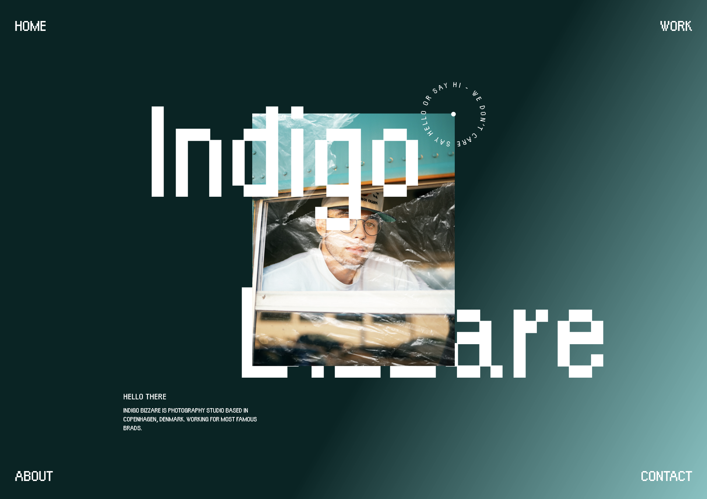

# Modern Layouts - 02/50 (#Made-In-CSS-Grid)

_50 days challenge on Modern Layouts using CSS Grid._

### Do you know??

❌ No Absolute or Relative positioning

✅ Use 12-column grid layout

✅ Responsive to each breakpoints

✅ Placing items using **Named Template Areas**
